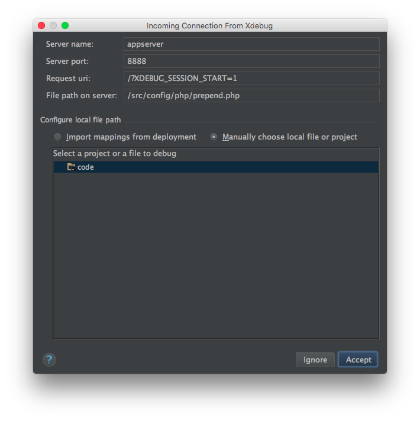
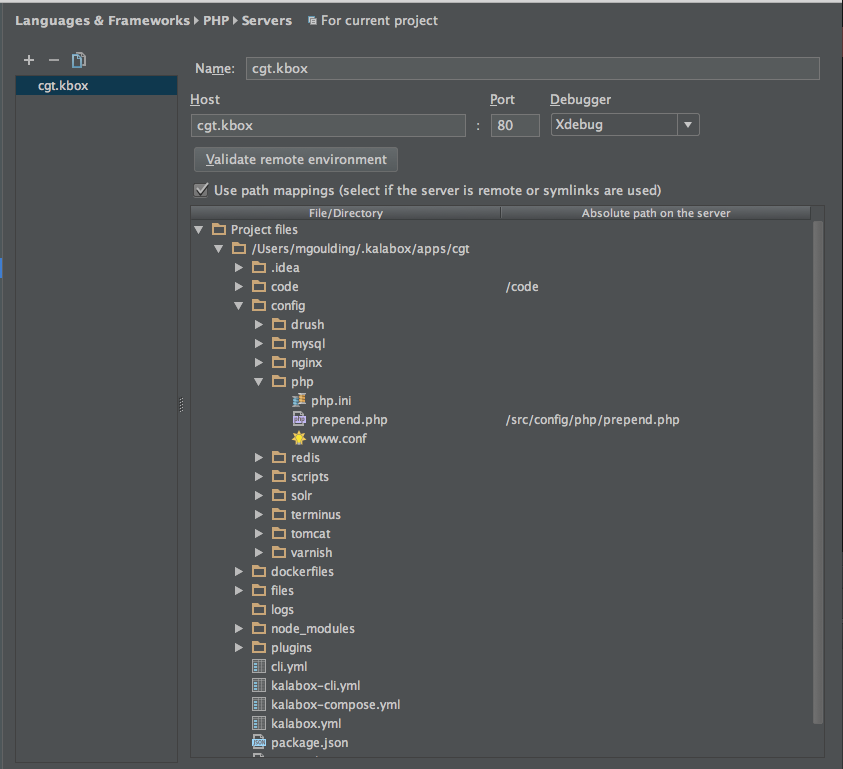
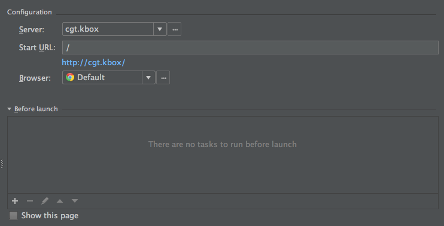

Development Tools
=================

Each Pantheon app you create also comes with a number of development tools you can use. Remember that these development tools run inside of their own containers so the experience will be slightly different than running the same tools natively. Please see the documentation below for some the differences for each command.

If you are interested in read more about how this all works, check out the core Kalabox docs on [tooling](http://docs.kalabox.io/en/stable/users/config/#tooling).

General considerations
----------------------

Here are a couple of small things to take into consideration for all your commands.

  * Your entire app directory is mounted inside each container at `/src`
  * We create and manage SSH keys so that we can use them for all the commands we run against Pantheon. These are stored in `~/.kalabox/pantheon/keys` by default.

Here are a few examples of how these can be used:

```bash
# Export your database with drush to a files called dump.sql in your app root
kbox drush sql-dump --result-file=/src/test.sql

# Use an alternate SSH key with rsync
kbox rsync -Pav -e 'ssh -i ~/.ssh/mykey.rsa' username@hostname:/from/dir/ /to/dir/
```

bower
-----

Runs [bower](https://bower.io/) commands.

```bash
# Install bower packages
kbox bower install

# Get the bower version
kbox bower --version
```

composer
--------

Runs [composer](https://getcomposer.org/doc/) commands.

`kbox composer`

  * You can edit the php-cli config locally at `config/terminus/php.ini`. Just make sure you `kbox restart` afterwards.

```bash
# Install dependencies with composer
kbox composer install

# Get the composer version
kbox composer --version
```

drush
-----

Runs [drush](http://www.drush.org/en/master/) commands.

  * The `config/drush` directory in your app will map to `~/.drush` inside the container.
  * You can add custom command files and view your aliases in `config/drush`.
  * There is a `drushrc.php` you can configure in `config/drush`.
  * You can edit the php-cli config locally at `config/terminus/php.ini`.
  * We automatically grab your Pantheon aliases files.

`kbox drush`

```bash
# Get the status of your drupal site
kbox drush status

# See all my Pantheon and custom aliases
kbox drush sa

# Download views
kbox drush dl views -y

# Get the drush version
kbox drush --version
```

!!! tip "Change Drush versions"
    We use Drush 8 but you can change this by editing the `FROM` directive in `dockerfiles/terminus/Dockerfile` and running `kbox rebuild`. Please make sure the `terminus` service in the `kalabox-cli.yml` is switched from `image` to `build`.

git
---

Runs [git](https://git-scm.com/documentation) commands.

  * We will create a `pantheon.kalabox.id_rsa` ssh key locally inside of `~/kalabox/pantheon/keys` and use this for all the `git` commands you run on this app.
  * We will use the name and email associated with your Pantheon account for your `git` commits.

`kbox git`

```bash
# Check the status of my git repo
kbox git status

# Stage all changes
kbox git add --all

# Commit all changes
kbox git commit -m "My amazing commit"

# Push master branch changes to some remote called origin
kbox git push origin master

# Get the git version
kbox git --version
```

!!! note "Can I use my normal git?"
    We only **officially** support using `kbox git` but you may find it faster and more convenient to run your own local `git`.

grunt
-----

Runs [grunt](http://gruntjs.com/getting-started) commands.

`kbox grunt`

```bash
# Run a grunt task called "grunt harder"
kbox grunt harder

# Get the grunt version
kbox grunt --version
```

gulp
----

Runs [gulp](https://github.com/gulpjs/gulp/blob/master/docs/getting-started.md) commands.

`kbox gulp`

```bash
# Run a gulp task called "gulp quietly"
kbox gulp quietly

# Get the gulp version
kbox gulp --version
```

mysql
-----

Drops you into a [mysql](http://dev.mysql.com/doc/refman/5.7/en/mysql-commands.html) shell.

  * This command actually runs against the `appserver` container.
  * By default we run commands as the `root` mysql user and against your application database.

`kbox mysql`

```bash
# Drop into a mysql shell
kbox mysql

# Get the mysql version
kbox mysql --version
```

node
----

Runs [node](https://nodejs.org/api/repl.html) commands.

  * We use node 4+

`kbox node`

```bash
# Run an arbitrary node script located locally at `~/myscript.js`
kbox node /src/myscript.js

# Get the node version
kbox node --version
```

npm
---

Runs [npm](https://docs.npmjs.com/) commands.

`kbox npm`

```bash
# Install dependencies
kbox npm install

# Get the npm version
kbox npm --version
```

php
---

Runs [php](http://php.net/manual/en/features.commandline.php) commands.

  * You can edit the php-cli config locally at `config/terminus/php.ini`.

`kbox php`

```bash
# Print out a list of enabled php modules
kbox php -m

# Run an arbitrary php script located in your code root
# We assume you are actually in your code root for this
kbox php hamsterdance.php

# Get the php version
kbox php --version
```

rsync
-----

Runs [rysnc](http://linux.die.net/man/1/rsync) commands on your files directory.

  * This command always runs relative to your `files` directory.

`kbox rsync`

```bash
# Get the rsync version
kbox rsync --version

# Sync down pantheon files manually
kbox rsync -rlvz --size-only --ipv4 --progress -e 'ssh -p 2222' dev.3ef6264e-51d9-43b9-a60b-6cc22c3129308as83@appserver.dev.3ef6264e-51d9-43b9-a60b-6cc22c3129308as83.drush.in:code/sites/default/files/ /media
```

terminus
--------

Runs [terminus](https://pantheon.io/docs/terminus/) commands.

  * The `config/terminus` directory in your app will map to `~/.terminus` inside the container.
  * We will automatically log you into terminus with the machine token you used to spin up the app.
  * You can edit the php-cli config locally at `config/terminus/php.ini`.
  * By default we will set `TERMINUS_USER`, `TERMINUS_SITE` and `TERMINUS_ENV` to match the details of your app.

`kbox terminus`

```bash
# Refresh my Pantheon aliases
kbox terminus sites aliases

# Get information about my app on Pantheon
kbox terminus site info

# Get information about a different site on Pantheon
kbox terminus site info --site=myothersite --env=dev

# Verify that I am still logged in
kbox terminus auth whoami

# Get the terminus version
kbox terminus cli version
```

wp
--

Runs [wp](http://wp-cli.org/) commands.

`kbox wp`

  * You can edit the php-cli config locally at `config/terminus/php.ini`.

```bash
# Get the wp version
kbox wp cli version
```

xdebug
------

Enables users to debug their php code.

### Sublime Text

Install the Sublime Text [xdebug plugin](https://github.com/martomo/SublimeTextXdebug) and follow the instructions there. You will want to end up with `settings` in your `*.project` config that look something like this:

```json
{
"settings":
  {
    "xdebug":
    {
      "max_children": 64,
      "max_depth": 8,
      "path_mapping":
      {
        "/code/": "/Users/pirog/Desktop/apps/picard-fan-site/code/"
      },
      "port": 9000,
      "pretty_output": true,
      "url": "http://picard-fan-site.kbox/"
    }
  }
}
```

If the `xdebug` session is not automatically triggered on reload try loading the page you want with the `XDEBUG_SESSION_START=1` parameter added eg `http://picard-fan-site.kbox/?XDEBUG_SESSION_START=1`

### PHPStorm

There are two ways to set up PHPStorm to use XDEBUG

#### Listen for incoming XDEBUG Connections

1. Use the default `xdebug` settings

  

2. Click the "Start Listening for PHP Debug Connections" button
3. Create a breakpoint
4. Initiate a connection by requesting your site  with the `XDEBUG_SESSION_START` parameter eg `http://kalabox-drupal7.kbox/?XDEBUG_SESSION_START=1`

PHPStorm will immediately pop up with this window; You may want to make sure `File path on server` is set correctly to `index.php`.

  

For more details see: [https://github.com/kalabox/kalabox/issues/1507#issuecomment-249271578](https://github.com/kalabox/kalabox/issues/1507#issuecomment-249271578)

Start Listening for PHP Debug Connections

#### Configure an XDEBUG Server

1. Navigate to Preferences -> Languages & Frameworks -> PHP -> Servers
2. Click the '+' to add a new server to the list.
3. Name it anything you like. Configure the host to be the local domain of your site without the protocol. Ex: `awesome.kbox`
4. Check the option that says "Use path mappings..." and a file browser will appear.
5. Map the code directory to `/code` and `/config/php/prepend.php` should map to `/src/config/php/prepend.php.`   
6. Click Apply
7. Naviate to Run -> Edit Configurations
8. Click the '+' at the top left and select PHP Web Application
9. Configure the server to the one you just configured in steps 1-6 and give this configuration a name 
10. Choose your default browser and click Apply
11. Start debugging by clicking the bug icon in the top right of the window or go to Run -> Debug (Name you configured in step 9) 

For more details see: [https://github.com/kalabox/kalabox/issues/1507#issuecomment-249276227](https://github.com/kalabox/kalabox/issues/1507#issuecomment-249276227)

### Troubleshooting

*My IDE doesn't seem to recognize the xdebug session.*

Be sure that nothing else is communicating on port 9000.  On OS X or Linux you can try
`sudo lsof -iTCP -n -P | grep "9000"`
You should only see com.docker with `(CLOSE_WAIT)`, and your IDE with `(LISTEN)`.
